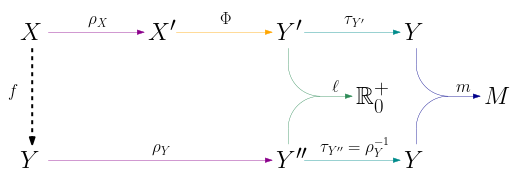
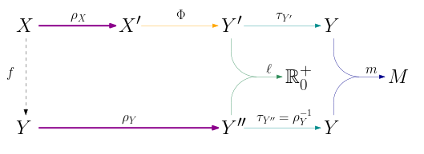
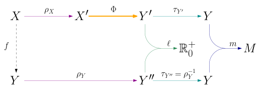
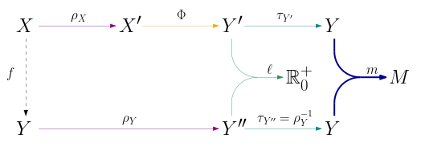
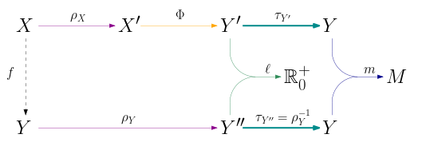
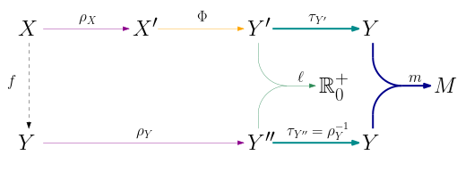
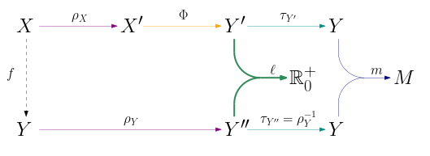
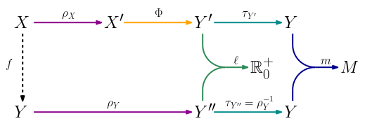

.. _systems_package-example:

Solving the CIFAR-10 problem using VGG networks
===============================================

This section describes an example *problem sub-package*, including an example *topology sub-package*; it is organised as follows:

* the :ref:`first sub-section <systems_package-example-layout>` describes how the ``CIFAR10`` problem sub-package and its ``VGG`` topology sub-package shipped with QuantLab are structured; in particular it describes which entities are defined in which files, and how they relate to the functional structure described in the :ref:`related section <systems_package-functional_description>` of the documentation;
* the :ref:`second sub-section <systems_package-example-pythonapi>` documents the Python software abstractions implemented in these packages.

.. _systems_package-example-layout:

Instantiating a DNN system
--------------------------

.. _systems_package-example-pythonapi:

Python API of the ``CIFAR-10`` and ``VGG`` packages
---------------------------------------------------
