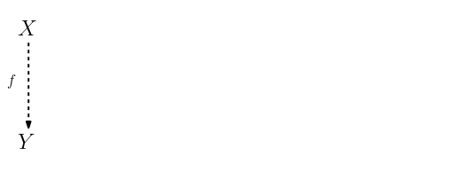
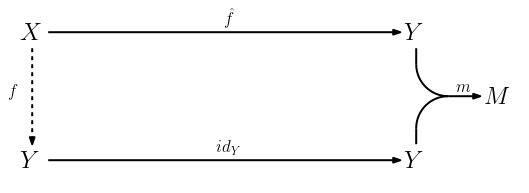
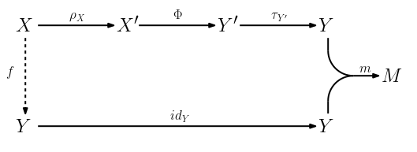
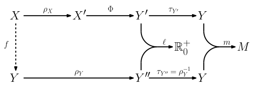

.. _systems_package:

The ``systems`` package
=======================

This section introduces the ``systems`` package, and is organised as follows:

* the :ref:`first sub-section <systems_package-needs_tools>` is a motivational discussion; it exemplifies the decompositions underlying the development of tools that respond to real-world needs and justifies the application of machine learning systems for solving certain tasks;
* the :ref:`second sub-section <systems_package-functional_description>` is a techincal discussion detailing a functional view of a DNN-based supervised learning model that justifies the structure of the package; it is a bit abstract and assumes some basic knowledge of algorithms and set theory on the part the reader;
* the :ref:`third sub-section <systems_package-overview>` provides an overview of the package and contains pointers to more detailed documentation.

.. _systems_package-needs_tools:

Needs and tools
---------------

The evolution of technology shifts the horizon of needs always further.
For example, the possibility of taking pictures cheaply using smartphones and sharing them in real-time on social networks creates the need to remain up-to-date with the most recent activities of your acquaintances (hopefully avoiding to spend your whole day scrolling through all their photos).
Another example: the possibility to register and classify sounds creates the need to instruct devices to solve tasks by issuing vocal commands.

Satisfying a new need requires developing some *ad-hoc* tool.
The development of a complex tool can be effectively faced by decomposing it using a *divide et impera* approach.
According to this approach, a complex tool is designed as a pipeline of simpler tools, each of which should solve a well-defined *task*.
Some tasks are currently too complex (or not sufficiently understood) to derive analytical solutions with closed-form specifications that can be translated into algorithms.
In these cases, machine learning systems might come to the rescue.

Each task can belong to one or multiple *domains*:

* image classification, image segmentation, object detection, pose estimation
  belong to the domain of computer vision (CV);
* sentiment analysis, document classification, language understanding,
  language translation belong to the domain of natural language processing
  (NLP);
* speech recognition and MI-BCI (motion imagery, brain-computer interface)
  belong to the domain of biological signal processing.

Now that we have defined this taxonomy in terms of domains and tasks, we can provide some examples of the *divide et impera* tool development methodology introduced above.

The need to remain up-to-date with your acquaintances' activities can be satisfied using a query-based tool arranged according to a client-server pattern.
When the user installs the client on his device, he will be asked to select a set of "interesting" topics (i.e., to define a filter) and would daily receive a selection of relevant pictures found amongst those of his contacts.
In exchange, the client will send to the server those pictures that he takes and uploads to the application.
The tool should:

1. on the server side, assign each picture of its users a label;
2. on the client side, query the server to retrieve the set of all images belonging to acquaintances of the user and whose labels appear in the set of the "interesting" topics selected by the user.

The first task is an example of image classification (that can be solved using a machine learning system), whereas the second task is a simple filtering operation over a list (that can be solved using standard algorithms for lists).

The need to instruct devices using vocal commands can instead be satisfied by a tool performing the following tasks:

1. translate the sound signals collected by a microphone into a UNICODE string of natural language;
2. tokenise this string into a sequence of abstract actions (each of which can be performed using a simple algorithm);
3. execute each action.

The first task is an example of speech recognition, the second task is an example of language understanding, and the last task is the traversal of a list.
The first two tasks can be solved using machine learning systems, whereas standard algorithms for lists should suffice to carry out the last one.

.. _systems_package-functional_description:

A zoo of problems and topologies
--------------------------------

The definitions that we provided in the previous section express our view of a task as a class grouping multiple *problems*.
Each problem can be functionally framed as a task instance, but the specific format of the data points and the problem metrics, together with the structural constraints that they impose on the class of models that can be used, hamper the portability of the solution (i.e., the actual computer program that solves the problem) to other problems of the same task.
For example, an image classification system designed to solve the MNIST data set will not fit image classification problems involving RGB images.

In the context of *deep learning*, solving a task on two different data sets usually requires re-designing the pre-processing, the DNN topology, and the post-processing.
However, DNN-based supervised learning systems follow the same functional structure, that we describe in the following.

Let :math:`\mathcal{X}` and :math:`\mathcal{Y}` be data structures with base sets :math:`X` and :math:`Y`, respectively.
Suppose that we need a way to map instances :math:`x \in X` to instances :math:`y \in Y`.
If we know the desired function

.. math::
   f \,:\, X \to Y \,,

we can derive and implement an algorithm :math:`\mathtt{f}` to compute :math:`y = \mathtt{f}(x) = f(x)`.
In many scenarios, :math:`f` is not known.

In these cases, the goal of a machine learning system developer is finding the best approximation of :math:`f` by using the information contained in an available *data set*.
A data set is a (finite) collection of input-output pairs collected experimentally, and can be naturally modelled as a function

.. math::
   \mathcal{D} \,:\, X \times Y \to \mathbb{N}_{0}

such that :math:`0 < \sum_{(x, y) \in X \times Y} \mathcal{D}(x, y) = N < +\infty`.
In technical terms, this object is called a *multi-set*.
In fact, despite the word *set* appearing in the locution *data set*, a specific pair :math:`(\bar{x}, \bar{y}) \in X \times Y` can appear multiple times in a data set, thus contradicting the definition of set (whose elements must be distinct).
Instead, multi-sets can count the multiplicity of items in a given collection: intuitively, :math:`\mathcal{D}(x, y)` counts how many times the pair :math:`(x, y)` appears in the data set.
Just in case :math:`0 \leq \mathcal{D}(x, y) \leq 1 \,,\, \forall \, (x, y) \in X \times Y` it is possible to identify :math:`\mathcal{D}` with a set (properly said):

.. math::
   \mathcal{D} = \{ (x^{(1)}, y^{(1)}), \dots, (x^{(N)}, y^{(N)}) \} \,.

   The (unknown) function :math:`f \,:\, X \to Y`.

The goal of a machine learning system is discovering the algorithm :math:`\mathtt{f}` implementing :math:`f`, or an approximation :math:`\tilde{\mathtt{f}}` implementing a function :math:`\tilde{f}` that should be "close" to :math:`f`.
The "closeness" of the approximating function :math:`\tilde{f}` to the true function :math:`f` is estimated by comparing the so-called *ground-truth labels* to the system's *predicted labels* over a data set called the *validation set*.
The comparison is performed using a *problem metric* function

.. math::
   m \,:\, Y \times Y \to M \,,

where :math:`M` is some space of problem-specific admissible values for the metric.
Given a data point :math:`(x, \hat{y})`, the problem metric function evaluates how "distant" the system's predicted label :math:`y = \tilde{f}(x)` is from the ground-truth label :math:`\hat{y}`.
For this reason, :math:`m` should have value zero when :math:`\hat{y} = y`.
For example, in classification problems we could set :math:`M = \{ 0, 1 \}` and defined the problem metric function as

.. math::
   m(\hat{y}, y) =
   \begin{cases}
       1, \,\text{if } \hat{y} \neq y, \\
       0, \,\text{if } \hat{y} = y.
   \end{cases}

In this way, the metric function quantifies whether the classification was performed correctly (:math:`m(\hat{y}, y) = 0`) or incorrectly (:math:`m(\hat{y}, y) = 1`).

   The metric function :math:`m` compares the predicted labels :math:`y = \tilde{f}(x)` with the ground-truth labels :math:`\hat{y} = id_{Y}(f(x)) = f(x)`.

DNNs have established a prominent position amongst machine learning systems both due to powerful approximation capabilities and appealing computational properties.
Indeed, DNNs enjoy data-independent control flow and parallelism at multiple scales (at the intra-neuron level, at the intra-layer level, and even at the inter-layer level), properties that make them an ideal fit for modern SIMD and MIMD computer architectures.
Deep learning frameworks such as TensorFlow and PyTorch implement DNNs as functions

.. math::
   \Phi \,:\, X' \to Y'

processing multi-dimensional arrays, called *tensors* due to the similarity of the structure used in differential geometry.
An aspect that might be underestimated by beginners or people with little experience in computer science is that not all data sets store their inputs and outputs in array format.
Therefore, before a DNN can process an input :math:`x \in X`, it is necessary to map it to an array :math:`x' \in X'` using a pre-processing function

.. math::
   \rho_{X} \,:\, X \to X' \,.

Analogously, not all problems accept an array :math:`y' \in Y'` as their output data structure.
Therefore, before feeding a problem metric function with the output :math:`y' = \Phi(x')` of a network, it is necessary to map such array into a suitable data structure :math:`y \in Y` via a post-processing function

.. math::
   \tau_{Y'} \,:\, Y' \to Y \,.

These ambiguities are usually not noticed by beginners also due to the fact that most tutorials deal with image classification problems, where both the inputs and the outputs can be straighforwardly represented as arrays.

   A DNN system typically realises :math:`\tilde{f}` as a composition :math:`\tau_{Y'} \circ \Phi \circ \rho_{X}`, where :math:`\rho_{X}` is a pre-processing function, :math:`\Phi` the DNN topology, and :math:`\tau_{Y'}` a post-processing function.

Each machine learning system has an associated space of algorithms (i.e., functions) that it can implement.
Such space is called the *hypothesis space* of the machine learning system, and the best approximating function :math:`\tilde{f}` must be selected from it.
An *hypothesis* is a point in this space that is identified by the structure of the corresponding function and its parameters.
Some learning systems have hypothesis that might differ from each other in the functional structure, whereas others are more constrained and their hypothesis differ from each other only in the parameters.
A DNN belongs to the latter class, and in QuantLab we refer to its hypothesis space as to its *topology*.
The research field of *neural architecture search* (NAS) is interested in deep learning systems whose hypothesis space encompass many different topologies.

The learning part of such a supervised learning system is usually framed as an optimisation problem, and is guided by the points in a data set called the *training set*.
Some learning algorithms accomplish this optimisation using a global search (e.g., support vector machines), whereas others use iterative approaches (e.g., DNNs).
Ideally, the "learning signals" (i.e., the piece of information that tells in which "direction" the parameters should be updates) should be determined in such a way to minimise the discrepancies measured by the problem metric function.
In the vast majority of cases, there is no unambiguous and convenient way of specifying how to generate learning signals using the problem metric function directly.
For this reason, in many learning systems such signal is generated using a "proxy" of the problem metric called the *loss function* (or *risk function*):

.. math::
   \ell \,:\, Y' \times Y'' \to \mathbb{R}_{0}^{+} \,.

Recall that QuantLab is based on PyTorch.
Similarly to other functions, PyTorch implements loss functions as sub-classes of the :py:class:`torch.nn.Module` class.
Some of these operations are implemented in such a way that :math:`Y'' = Y'` (e.g., :py:class:`MSELoss`).
Others, for computational reasons, find it more convenient using :math:`Y'' \neq Y'` and performing the "homogeneisation" internally (e.g., :py:class:`CrossEntropyLoss`).

   The loss function compares the output of the network, :math:`y' = \Phi(x')`, with a pre-processed ground truth-label :math:`\hat{y}'' = \rho_{Y}(y)`.
   An ideal loss function should be such that :math:`\ell(\hat{y}'', y')` is very well correlated with :math:`m(\hat{y}, y)`.
   Note that it might be necessary to pre-process ground-truth labels to compare them with the netowrk predictions.
   In these cases (i.e., when :math:`\rho_{Y} \neq id_{Y}`), to estimate the performance of the model it might be necessary to revert the pre-processing using a ground-truth label post-processing function :math:`\tau_{Y''} = \rho_{Y}^{-1}`.
   When :math:`Y'' = Y'`, it is possible to define :math:`\tau_{Y''} = \tau_{Y'}` and therefore :math:`\rho_{Y} = \tau_{Y'}^{-1}`.

.. _systems_package-overview:

Overview
--------

The systems package is a Python package acting as a "hub" for general-purpose, problem-specific, and topology-specific abstractions that can be used to assemble and configure very different DNN systems with relative ease.
The tree structure of the systems package has a specific semantic, based on the functional view of DNN-based learning systems outlined in the previous sub-section.
The more we descend the tree, the more specific to a given problem-topology combination the abstractions implemented become.

Most sub-folders of the systems package are themselves Python packages (i.e., folders containing an ``__init__.py`` file), which we will therefore call *sub-packages*.
Analogously, most non-folder files in the systems package are Python modules (``.py`` files).
The non-package sub-folders and non-module files have a special purpose, that we will describe in the :ref:`section on the CIFAR-10/VGG example <systems_package-example>` and in the :ref:`section on working files <systems_package-working_files>`.

We will refer to the collection of symbols exposed in an ``__init__.py`` file as the *namespace* of the corresponding package.
We say that a namespace has depth :math:`n` if the folder of the package is at depth :math:`n` from the root of the systems package.
We also call namespaces defined in the systems package **QuantLab libraries**.

At depth one, we encounter the :ref:``utils sub-package <systems_package-utils>``.
This sub-package hosts general-purpose abstractions.
These abstractions can in principle be used to solve any given problem, independently of both the problem and the topology.
Examples of such abstractions are loss functions and different variants of the gradient descent algorithm.
Many abstractions of this kind are already implemented in PyTorch; therefore, the utils sub-package act as a complement with respect to it.
The namespace of the utils sub-package has depth one, and we call it the **systems library**.

At depth one, we encounter **problem sub-packages** (problem sub-packages are therefore siblings to the utils sub-package).
The files and sub-files in a problem sub-package implement abstractions that are suitable to solve that problem only.
Some of these abstractions can be shared amongst different DNN systems that solve that specific problem, independently of the DNN topology.
Examples of such abstractions are non-structural pre-processing transforms (e.g., data augmentation functions :math:`\alpha_{X} \,:\, X \times \Omega \to X` that take a data point :math:`x \in X` and return a stochastically modified point :math:`x_{\omega} = \alpha_{X}(x, \omega) \in X`), and problem metric functions.
Semantically, it make sense to group these abstractions inside a ``utils`` sub-package of the problem sub-package.
To distinguish such sub-package from the one described above, we call the latter the *problem utils sub-package*, whereas the former the *systems utils sub-package*.
The namespace of the problem utils sub-package has depth two, and we call it the **problem library**.

Inside each problem sub-package, at depth two from the root of the systems package, we encounter **topology sub-packages** (each topology sub-package is therefore a sibling to some problem utils sub-package).
A problem sub-package can contain multiple problem sub-packages, that are therefore siblings to each other.
The files in a topology sub-package implement abstractions that are suitable only for the corresponding problem-topology combination.
Examples of such abstractions are the DNN topology itself, structural pre-processing transforms (i.e., functions that take a data point :math:`x \in X` and turn it into an array :math:`x' \in X'` compatible with the DNN topology), and post-processing functions.
The namespace of the topology sub-package has depth two, and we call it the **topology library**.

To better understand the hierarchy of the systems sub-package, including non-package folders and non-module files, we refer the reader to the :ref:`example on CIFAR-10/VGG <systems_package-example>`.
Although some of the abstractions defined in these packages can be used outside a QuantLab session, they are meant primarily to be used by QuantLab's experiment manager.
In particular, the systems package is the only part of QuantLab where a normal user is meant to create and modify files.
The section of the documentation on :ref:`working files <systems_package-working_files>` summarises the abstractions that should be implemented in each sub-package, their types, and the format of the files contained in the package folders.

.. toctree::
   :maxdepth: 1
   :caption: Contents:

   utils
   cifar10vgg
   workingfiles
