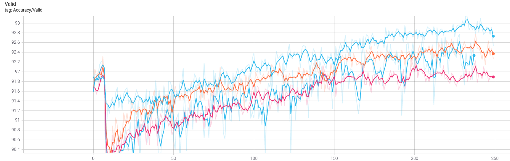

# VGG for CIFAR10

This package contains multiple example configurations for solving
CIFAR10 with quantized VGG networks. Simply copy the one you want to use
to `config.json` and run the `configure` and `train` flows\!

On models which start from a pretrained full-precision checkpoint,
download the checkpoint into a folder of your choosing and adjust the
configuration entry
accordingly.

## Configurations

| Config                        | Description                                                                                                     | Algorithm | Act. Rounding | Pretrained | Full Checkpoint | FP32 Accuracy | Final accuracy |
| ----------------------------- | --------------------------------------------------------------------------------------------------------------- | --------- | ------------- | ---------- | --------------- | ------------- | -------------- |
| `config.json`                 | Default config for fully ternarized VGG8, quantized using the [ANA](https://arxiv.org/abs/1905.10452) algorithm | ANA       | N/A           | No         | TODO            | TODO          | TODO           |
| `config.vgg9.pact.2b_noround` | 2b VGG9 quantized using PACT+SAWB (first & last layers in 8b)                                                   | PACT+SAWB | No            | TODO       | TODO            | 93%           | TODO           |
| `config.vgg9.pact.2b_round`   | 2b VGG9 quantized using PACT+SAWB (first & last layers in 8b)                                                   | PACT+SAWB | Yes           | TODO       | TODO            | 93.03%        | TODO           |
| `config.vgg9.tqt.2b_noround`  | 2b VGG9 quantized using TQT (first & last layers in 8b)                                                         | TQT       | No            | TODO       | TODO            | 93.03%        | TODO           |
| `config.vgg9.tqt.2b_round`    | 2b VGG9 quantized using TQT (first & last layers in 8b)                                                         | TQT       | Yes           | TODO       | TODO            | 93.03%        | 93.22%         |

## Comments on Final Accuracy

While the numbers in the above table may not show large differences
between the different algorithms, they do not tell the whole story as
they are "peak accuracy" numbers, i.e., the highest validation accuracy
achieved during each of the training runs. The below image does a better
job at illustrating the differences and the advantages of simulated
rounding.

 LEGEND:

  - Upper blue line: TQT + rounding
  - Lower blue line: TQT, no rounding
  - Orange line: PACT/SAWB + rounding
  - Magenta: PACT/SAWB, no rounding

As you can see, the accuracy behaves in a much more stable way for the
TQT+rounding configuration. The smoothed accuracy for configurations
without rounding is noticeably lower than for the same algorithm with
rounding enabled, and TQT without rounding behaves very erratically -
likely due to the fact that the gradients for the log-thresholds are
computed under the assumption of rounding. Nevertheless, all
configurations achieve comparable peak accuracies.
